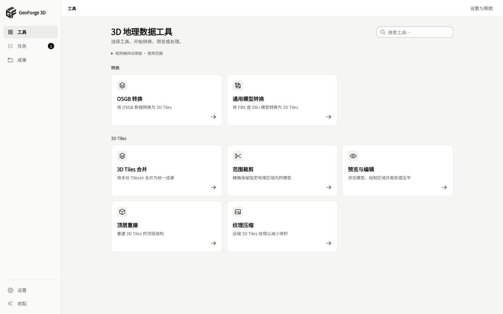
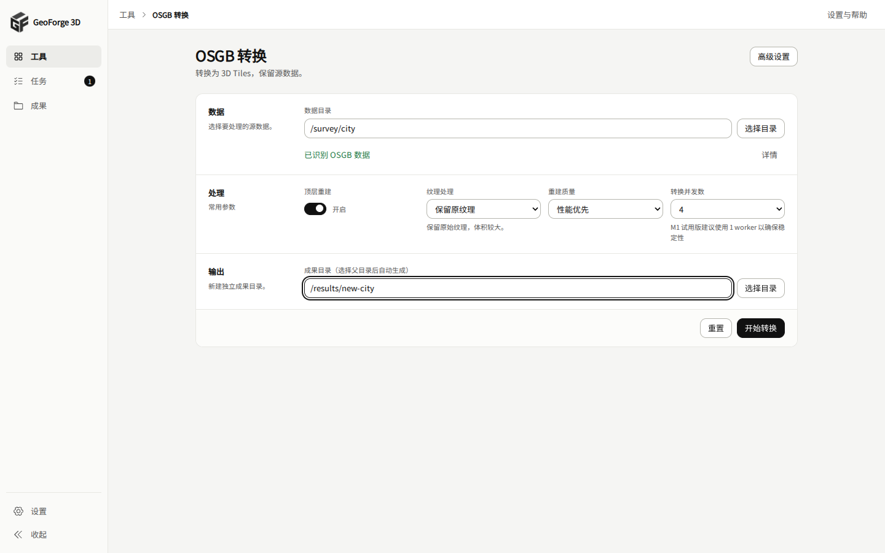
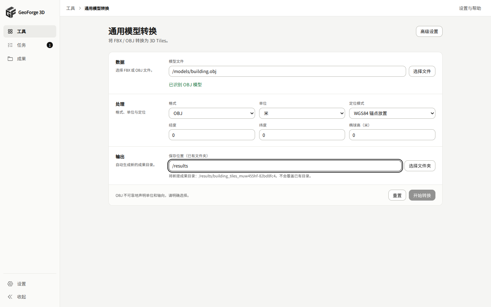
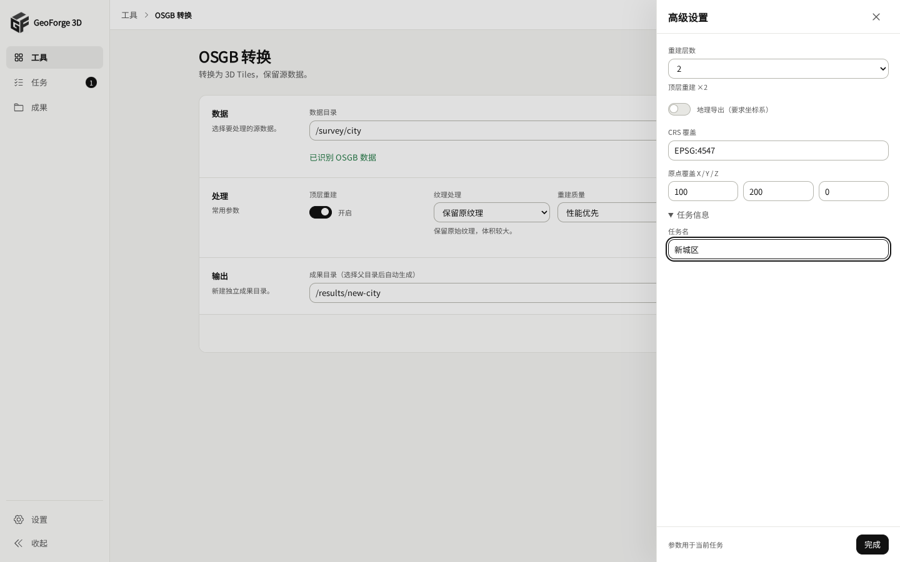
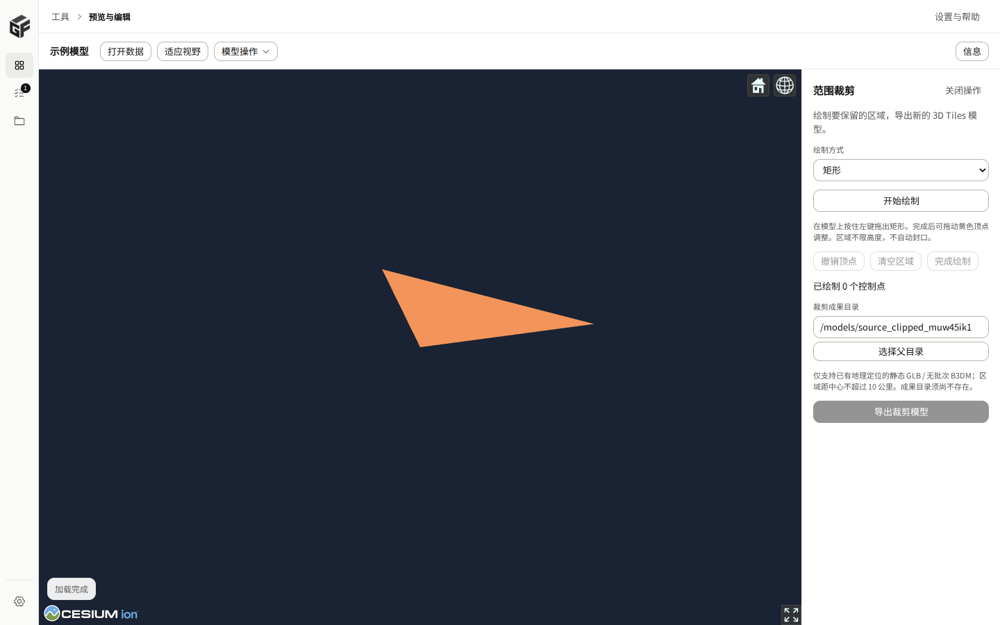

# GeoForge Compact V2 UI 重构

日期：2026-10-06。代码基线：`4adc42d2532600c4eae4760d8e460ba537d47cff`。

设计基准为 `geoforge-ui-compact-v2.html`；品牌使用第 4 个 GF 立体 Logo 原图中的符号，原图保存在 `apps/desktop/public/brand/geoforge-logo-v4.png`，由 CSS 显示符号区域。

## 界面变化

- 176px 可收起侧栏、48px 路径顶栏，工具子页面继续选中“工具”。原有工具、任务、成果、设置路由保留。
- OSGB 与通用模型转换采用紧凑的“数据 → 处理 → 输出”分区。OSGB 主区展示重建开关、纹理、质量和并发；模型主区展示格式、单位、定位模式，按模式展开锚点或投影坐标。
- 重建层数、坐标覆盖、模型轴向、外部贴图目录和任务名按各工具原有能力进入高级设置抽屉。关闭或重新打开抽屉保留表单参数；Escape、遮罩点击、Tab 循环及关闭后焦点恢复均有覆盖。
- 合并、参数裁剪和优化页面使用相同表单结构。提交成功后进入对应任务详情；错误保留表单，原有输出路径生成和校验继续使用。
- 任务使用紧凑列表，键盘可打开详情，日志默认收起；保留原有筛选、取消和重新处理行为。成果列表显示可查看完整值的截断路径，缺失文件的操作不能通过键盘触发。
- 预览以真实 Cesium 画布为主体，信息或裁剪/压平检查面板按需打开。嵌入预览隐藏重复的 URL/诊断浮层；独立预览和显式 debug 模式保留该浮层。

HTML 设计稿中的参数仅按实际能力接入。没有添加新的输出格式、预设、资源估算或扫描统计。现有规则格网试用范围仍可从工具首页展开查看。

## 保留的业务边界

`crates/`、`src-tauri/`、API 适配器和类型、校验函数、输出命名规则、处理器、转换器均未修改。绘制和压平模块及其消息协议也未修改。任务请求使用原有构造函数和字段；本次改变的是控件位置、反馈和提交后的页面导航。

仓库原本跟踪 `apps/desktop/dist/`，本次同步提交从当前源码重新构建的前端文件。新增到 dist 的绘制/压平模块来自基线已有的 public 源码，不是新的业务实现。

## 验证

| 检查 | 结果与范围 |
| --- | --- |
| `npm run build` | 通过，包含 TypeScript 检查和 Vite 生产构建 |
| `npm test` | 原有前端纯函数测试通过 |
| `npm run test:ui` | 11 项通过，覆盖导航、Logo、路径、抽屉、条件参数、提交协议、失败保留、筛选、取消调用、成果、设置和布局 |
| Cesium 页面检查 | 真实加载离线 GLB fixture，验证信息、裁剪、压平面板以及绘制命令/反馈；无页面异常 |
| 窗口尺寸 | 1440×900 截图检查；1366×768 与 1024×768 检查横向溢出及转换按钮首屏可见性 |
| `git diff --check` | 通过 |
| `npm run test:e2e` | 环境阻塞：`cargo: not found`，处理器参与的原有端到端测试未执行 |
| Windows 安装包 / 原生 IPC | 当前 Linux 环境未验证，需在 Windows 环境按既有流程检查 |

UI 测试在浏览器中模拟 Tauri 命令返回值，并断言经原有 API 适配器提交的请求；这不代表真实处理器导出或 Windows IPC 已通过。Cesium 渲染使用真实运行时与 GLB 数据，任务创建、取消和设置持久化使用测试替身。

复跑 UI 测试：在 `apps/desktop` 执行 `npm ci`、`npx playwright install chromium`、`npm run test:ui`。已有 Chromium 的受限环境可通过 `PLAYWRIGHT_EXECUTABLE_PATH` 指定浏览器。可选 `GEOFORGE_UI_SCREENSHOTS` 指定截图目录；无中文系统字体时，`GEOFORGE_UI_FONT` 可指定本地 WOFF2 中文字体，仅用于测试。

## 截图

以下为当前实现的浏览器截图，使用测试任务与模型数据。

