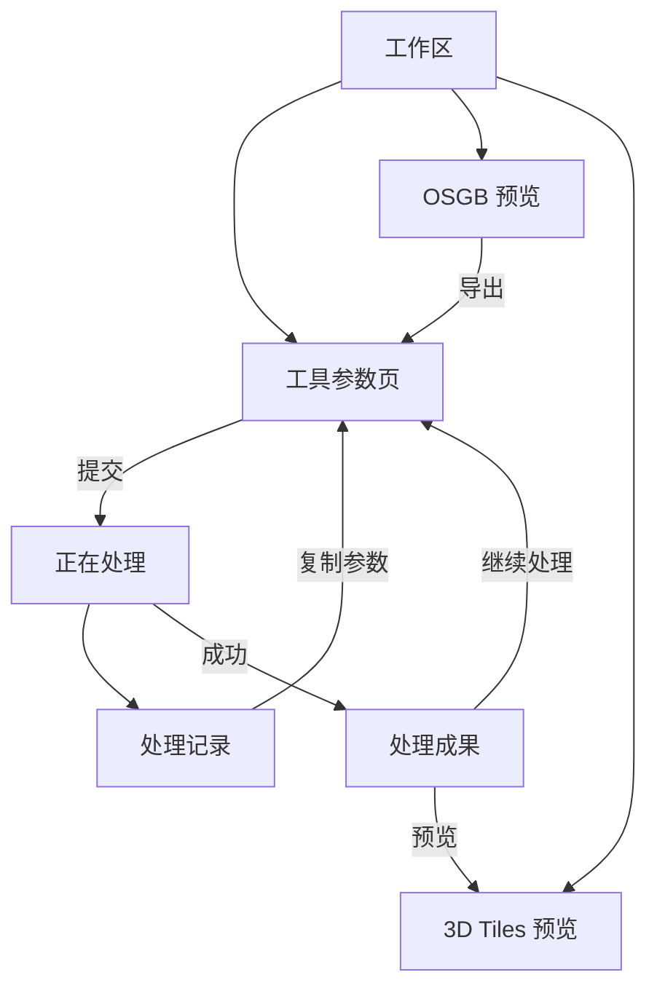

# Cesium 生态数据处理工具：产品定义

版本：v0.2 · 日期：2026-09-09 · 产品名称待定

本文描述整体产品方向；与之配套的《02-v1-implementation.md》描述第一版范围与执行方案。两份文档根据本次讨论编写，取代此前草案中“统一 OSGB / 3D Tiles 预览器”等已经调整的建议。

## 1. 产品目标

开发一个类似 CesiumLab 的开源、本地优先的数据处理工具。让用户完成源数据检查、格式转换、模型优化、可视化编辑和成果导出，逐步覆盖 Cesium 生态下的三维模型、影像、地图切片和地形数据。

首个重点是倾斜摄影：直接预览 OSGB，转换为 3D Tiles，通过顶层重建改善大范围初始加载，通过纹理压缩减少资源占用，再预览输出结果。

产品参考 CesiumLab 的工具入口、分组参数和集中任务管理方式。界面采用简约、现代的风格。自行设计品牌、图标和组件，不复制商业产品素材。

## 2. 已确定的产品原则

1. 工作区是工具入口。用户无须先创建项目，即可进行数据处理。
2. 工具在主窗口内打开，页面按用途独立组织。
3. OSGB 和 3D Tiles 分开预览，保持操作习惯与视觉一致。
4. OSGB 选择目录后开始加载原始数据，无须先完成格式转换。允许扫描和渐进加载，不承诺任何规模都瞬时打开。
5. 转换、重建、压缩等耗时工作进入统一任务管理；切换页面不终止任务。
6. 预览页面可以发起导出，直接处理页面也可以提交相同能力。
7. 输出默认保留源数据，失败或取消的中间文件不作为正式成果。
8. 编辑后的导出必须落实到实际几何和纹理，不能只保存屏幕上的裁剪或变形效果。
9. 数据服务发布优先级低，不纳入第一版，也不作为本地预览的使用前提。

## 3. 总体功能地图

| 方向 | 长期能力 | 第一版关系 |
| --- | --- | --- |
| 倾斜摄影 | OSGB 数据检查、预览、转换、坐标定位 | 首版重点 |
| 3D Tiles | 预览、顶层重建、纹理压缩、合并、检查、裁剪等 | 首版实现预览、重建、压缩和必要检查 |
| 模型编辑 | 范围绘制、裁剪、压平、撤销重做、保存编辑、导出 | 首版只提供基础预览和导出入口；实际编辑后续实现 |
| 通用模型 | FBX、OBJ、glTF/GLB 的导入、预览、优化与切片 | 后续 |
| BIM/CAD | Revit、MicroStation 插件，保留几何、材质、属性和结构 | 后续 |
| 影像与地图切片 | 影像处理及切片、已有 XYZ 数据处理、WMTS 接入与缓存 | 后续，三类操作分别定义 |
| 地形 | 高程数据预览、合并、裁剪、重采样、地形切片 | 后续 |
| 数据服务 | 发布成果供其他应用使用 | 低优先级 |
| 通用任务 | 排队、进度、取消、日志、历史、成果与配置复用 | 首版基础能力 |

未来工具的位置在架构上保留，尚未实现的工具不显示为可用入口。首版不为未来功能搭建插件市场或通用流程编排器。

## 4. 应用页面与导航

外层为 Qt 主窗口，提供稳定的左侧导航和轻量标题栏。右侧内容区域切换 Web 页面和 OSGB 原生页面。用户不需要认识或选择渲染引擎。

| 页面 | 内容与主要操作 |
| --- | --- |
| 工作区 | 分类工具入口、搜索、常用工具 |
| 工具参数页 | 输入数据、处理设置、输出与提交 |
| 正在处理 | 所有排队和运行任务、进度、阶段、日志、取消 |
| 处理记录 | 成功、失败、取消、中断的历史记录，复制参数重新处理 |
| 处理成果 | 可用数据，打开目录、复制路径、预览、继续处理 |
| OSGB 预览 | 原生数据浏览、基本信息、导出 3D Tiles |
| 3D Tiles 预览 | 原始或输出 Tileset 浏览、基本信息、加载状态 |
| 设置与帮助 | 默认输出位置、缓存、并发资源设置、文档与版本信息 |

工作区点击后总是回到工具首页。“正在处理”单独显示数量徽标，不根据任务状态改变工作区按钮的目的地。

### 4.1 工作区

使用紧凑工具卡片，每项包含图标、名称和一句用途说明。按倾斜摄影、3D Tiles、通用模型、影像切片、地形分组。首版实际显示 OSGB 转换、3D Tiles 处理、OSGB 预览、3D Tiles 预览。

“3D Tiles 处理”内部提供顶层重建、纹理压缩及组合执行，不要求每项算法都有独立首页卡片。

### 4.2 参数页面

保留 CesiumLab 的输入—处理—输出顺序。宽屏使用三组规整面板，中间处理设置较宽；小窗口按相同顺序纵向排列。它是固定处理流程的参数界面，不是自由节点编辑器。

- 输入：目录或 Tileset 文件、识别结果、坐标信息与必要校验。
- 处理：转换、重建、压缩选项及分组高级参数。
- 输出：位置、格式、任务名称和最终参数摘要。
- 底部：固定提交按钮和校验摘要；字段错误显示在字段附近。

复杂术语给一句用途说明。质量损失、坐标覆盖等会改变结果的设置，应让用户看见实际生效值。工具页面离开后保留当前会话的配置。

### 4.3 预览页面

OSGB 和 3D Tiles 各自加载数据，各自管理相机和渲染资源。导航和按钮命名统一，不强制叠加在同一个场景中。

OSGB 预览发起导出时带入源路径和已确认的定位信息，转换仍读取完整源数据，不能把当前画面已加载的模型当作完整输入。

后续“保存编辑”保存源数据引用、编辑参数和视图状态；“导出”生成真实数据。保存文件形式留给编辑版本设计，首版不增加空的项目系统。

## 5. 任务与成果规则

一个任务对应一个明确输入数据集和输出位置，内部可以包含多个阶段。OSGB 数据集里的大量文件不是大量独立用户任务。

默认一次运行一个重任务，其余排队；任务内部允许多线程，但并发数量需要考虑内存。取消和重新执行纳入首版；暂停、断点续跑不承诺。

正在处理展示阶段、进度、已用时间和日志入口。无法计算总进度时显示阶段与已完成数量，不制造百分比或剩余时间。

任务历史与成果分开：历史记录执行过程，成果记录可用输出。一项成果可追溯来源任务；再次处理默认产生新成果。源数据被移动、删除时，成果显示不可用并允许定位，不静默当成正常文件。

输出先写临时目录，通过检查后再成为正式成果。重新启动应用时，不把之前的运行状态直接当成仍在运行；根据进程和结果记录恢复状态，无法确认的标为中断。

## 6. 数据与坐标原则

OSGB 首版接受常见标准目录：数据集根目录含 metadata.xml 与 Data，各分块目录含同名入口 OSGB，下级关系通过节点引用读取。预览可以在缺少地理定位时使用局部坐标；地理导出必须补全必要信息。

坐标系以广泛支持为目标，明确包括 CGCS2000。产品需要区分地理坐标、投影坐标、分带、中央经线、单位、局部原点以及高程基准。用户给出“2000 坐标系”不足以确定全部转换参数，不能静默猜测。

3D Tiles 处理首版覆盖显式层级、外部 Tileset 引用、B3DM 与 glTF 2.0 网格内容。扩展、压缩和属性有各自兼容边界，以实施文档为准。预览可利用渲染器显示更广泛类型，但不因此承诺可以处理。

## 7. 技术架构方向

| 部分 | 方向 |
| --- | --- |
| 桌面外壳 | Qt，管理导航、窗口、原生能力与任务生命周期 |
| Web 页面 | React + TypeScript，承载工作区、表单、任务与成果 |
| OSGB 预览 | OpenSceneGraph 原生视口 |
| 3D Tiles 预览 | CesiumJS，内嵌 Web 页面 |
| 处理内核 | 以 C++ 为主，按块处理；读取、转换、重建和压缩分模块 |
| 任务执行 | 独立命令行进程，结构化进度与结果 |
| 本地记录 | 建议 SQLite 保存任务、成果、设置；数据文件保留在文件系统 |

Web 与原生只交换控制参数、摘要和事件，不通过桥接传输海量网格。预览和转换共享读取与坐标规则，调度分别实现。处理库不依赖界面。

可先接入已验证的外部转换器，再逐步抽取复用代码；不以语言统一为理由提前重写全部算法，也不把外部程序内部参数直接暴露成长期产品接口。

## 8. 视觉方向

默认浅色界面、蓝色强调色、系统无衬线字体、统一线性图标、细边框、小圆角、少阴影。状态同时用文字和颜色表达。OSGB 原生页面与 Web 页面使用相同设计变量。

建议从 1440×900 设计稿起步，并检查 1280×800 及高 DPI。正文约 14px、控件高约 36px、8px 间距基准，最终以可读性验证调整。三维视口背景可独立配置，深色主题后续扩展。

## 9. 交付和决策状态

已确定：产品组织、首版主要能力、两种预览分离、Qt/Web/OSG 混合方向、独立任务进程、源数据保护、服务发布延期。

执行默认值：Windows x64 首发；具体 Qt/OSG 版本、组件库、打包工具由执行 agent 在兼容原型后锁定。Windows x64 是建议的交付起点，尚未得到用户单独确认，不作为跨平台长期限制。

尚需实测：Qt 与 OSG/WebEngine 集成、现有转换器质量、顶层重建效果、大数据资源上限。执行 agent 应先完成有代表性的验证，再据结果补齐依赖版本和性能报告。未经验证的算法路线不能描述为成熟能力。

## 10. 参考资料

- [CesiumLab 官网](https://m.cesiumlab.com/)：产品参考，部分页面访问受限。
- [V3.0.4 使用手册公开转载](https://www.scribd.com/document/758567133/CesiumLab地理信息基础数据处理平台使用手册)：集中任务及服务流程。
- [官方作者 V4.0.7 操作文章](https://blog.csdn.net/weixin_43805235/article/details/145186086)：通用模型的输入与分组参数。
- [通用模型切片截图](https://juejin.cn/post/7370678396373696538)、[地形切片截图](https://blog.csdn.net/weixin_43081649/article/details/129850285)：用于观察布局，非最新版本完整实操。

后续执行以本文和第一版实施文档为准；旧草案中的统一预览、首版排除 OSGB 预览等建议已经被本轮讨论更新。
