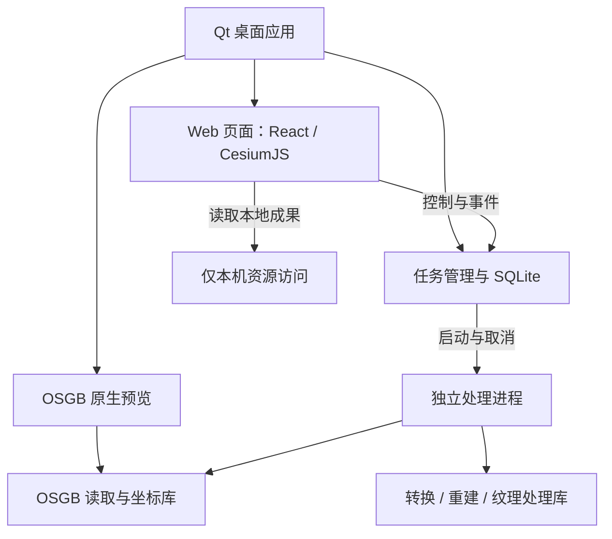

# 第一版实施文档：OSGB 与 3D Tiles 处理

版本：v1.0-draft · 日期：2026-09-09

面向执行 agent。配套文档：01-product-definition.md。本文给出可执行的边界与建议方案，不代表算法已经实现或性能已经验证。用户已同意逐步验证现有项目并复用代码，未要求立即整体重写。

## 1. 第一版目标与完成标准

完整支持两条路径：

1. 打开标准 OSGB 目录，直接浏览原始模型；发起转换，可选顶层重建与纹理压缩；在 3D Tiles 预览中检查成果。
2. 打开已有 3D Tiles，独立执行顶层重建、纹理压缩或组合执行，生成新成果。

首版完成意味着真实数据可用、参数真实生效、失败可诊断、结果可独立加载。仅搭建界面、调用一个未验证的 EXE、合并索引或展示模拟进度，都不算完成。

首发默认 Windows x64，Qt/原生代码保持跨平台结构。该平台是执行建议，尚非用户单独确认的平台承诺；不要求首版同时交付 Linux、macOS。

## 2. 功能边界

| 功能 | 首版必须交付 | 首版不做 |
| --- | --- | --- |
| OSGB 输入 | 标准目录、节点引用扫描、必要元数据读取与错误报告 | 任意厂商目录自动修复 |
| OSGB 预览 | 原生渐进加载、平移旋转缩放、全景定位、基本信息、导出入口 | 裁剪、压平、编辑工程保存、多数据地理融合 |
| 转换 | OSGB → 3D Tiles，坐标定位、原层级转换、输出检查 | FBX、Revit、MicroStation 等 |
| 顶层重建 | 生成真实低精度概览几何和纹理，连接原有子树 | 全数据重新切块、BIM 语义聚合、点云重建 |
| 纹理压缩 | 单独或组合处理，尺寸控制、KTX2 编码、保留材质引用 | 所有纹理扩展与编码的无限兼容 |
| 3D Tiles 预览 | 本地打开、基本相机操作、范围、加载状态与错误 | 完整 GIS 分析与场景编辑 |
| 任务 | 排队、运行、阶段进度、取消、日志、历史、重新执行 | 暂停、断点续跑、分布式计算 |
| 成果 | 登记成功输出、预览、打开目录、继续处理 | 对外服务发布 |

组合任务建议顺序：扫描与检查 → OSGB 转换（如需要）→ 顶层重建（如需要）→ 最终纹理压缩 → 检查 → 提交成果。避免先有损压缩原模型纹理，再解码用于顶层生成。

## 3. 输入、输出与兼容矩阵

### 3.1 OSGB

输入选择数据集根目录，支持用户误选 Data 后识别并提示归一化。常见结构为 metadata.xml、Data/Tile_x_y/Tile_x_y.osgb。入口文件与目录名称关联，下级沿 PagedLOD 等实际引用读取，不用文件名猜全部层级。

读取文件存在性、可解析性、局部变换、空间参考、原点、入口分块数量。预览只做必要入口扫描后开始加载；完整数据检查放后台或导出前执行。缺元数据可局部预览，地理导出需补齐定位。

结构不符合范围时给出具体目录和原因。缺子文件导致不完整时默认阻止正式导出；预览可展示可读取部分，但必须说明缺失。

### 3.2 3D Tiles

以下是首版实现目标；遇到不支持的情况预检拒绝或仅允许预览，不静默删除内容。

| 项目 | 处理策略 |
| --- | --- |
| 显式树、外部 Tileset | 支持递归读取；相对 URI 相对于所属 JSON 解析；防止引用循环 |
| B3DM | 支持标准头部及 glTF 2.0 载荷，正确处理表和定位；旧式非标准布局报错 |
| GLB/glTF | 支持静态三角网格、常规材质、外部 bin 与纹理、节点变换 |
| 基础模型扩展 | 明确测试 KHR_materials_unlit；压缩输入需要相应解码支持 |
| Draco、meshopt | 目标支持 KHR_draco_mesh_compression、EXT_meshopt_compression 的网格解码；实际依赖版本和夹具锁定后写入兼容表 |
| KTX2 | 允许保留已有纹理；仅在需要缩放或重建且解码受支持时处理，默认不重复有损压缩 |
| 单瓦片多个 contents | 首版处理不支持；明确拒绝，后续扩展 |
| i3dm/pnts/cmpt、隐式树 | 不纳入首版处理；预览是否可用取决于固定版本 CesiumJS |
| 动画、骨骼、变形、实例扩展 | 不纳入首版重建输入，不能简单按静态三角网处理 |
| ADD 细化 | 纹理处理可保留原语义；首版重建限定可证明覆盖完整的 REPLACE 网格子树 |
| required 未知扩展 | 阻止处理；不能删扩展后输出 |
| 远程资源、3TZ/数据库等容器 | 首版处理限定完整本地目录；必要的本地外部依赖需登记并复制 |

纹理处理不得改变几何、属性和层级语义；原 B3DM 的 feature/batch tables 及相关引用必须保留。顶层新生成模型暂不承诺原构件级属性拾取；原细节瓦片和属性保留。需要所有层级保留 BIM 语义的输入不属于首版重建范围，界面预检说明限制。

输出建议：默认 3D Tiles 1.1 + GLB；提供 1.0 + B3DM 兼容选项。两种是本稿建议的执行默认值，需各自有加载夹具。1.1 直接引用 glTF 是标准路线，legacy B3DM 的地位参见 [3D Tiles 规范](https://github.com/CesiumGS/3d-tiles/tree/main/specification)。已有数据后处理尽量保持内容形式；不能只修改 asset.version 而不处理不兼容语义。

### 3.3 坐标与高程

使用 PROJ/GDAL 生态支持坐标解析与转换，明确包含 CGCS2000 的地理坐标及常用高斯投影。产品“支持多坐标系”不等于缺参数时自动猜测。

- 支持识别元数据、EPSG 代码、WKT；显示最终实际采用的 CRS 和原点。输入与输出轴序在适配层显式统一。
- 明确单位、分带、中央经线、假东移、局部坐标和 SRSOrigin 的关系；避免重复加原点。
- 地方独立坐标系需要对应定义和转换参数，无法定位时阻止地理导出。
- 高程基准独立处理：椭球高、正常高及偏移量不可混为一谈。必要格网缺失时明确提示；不把一次手工高度偏移宣称为完整高程基准转换。
- 禁止在精度要求未满足时静默采用低精度替代转换；记录实际操作、精度信息和必要的数据文件。[PROJ 转换说明](https://proj.org/en/stable/usage/transformation.html)
- 内部几何保留局部米制坐标；地理放置采用双精度变换。已地理定位的 Tileset 不重复应用 OSGB 的源坐标转换。

验收至少包括 CGCS2000 地理坐标和一个投影分带、非零原点、已知高程点；对照可靠参考结果，水平和垂直误差分别记录。

## 4. 总体架构



图中 P 是进程边界；其内部处理库不依赖 UI。Qt WebEngine 还可能自行启动辅助进程，不把图理解为操作系统里严格只有两个进程。

### 4.1 桌面与 Web

建议 Qt 6 Widgets + QStackedWidget：左侧固定 Qt 导航，内容区域切换 QWebEngineView 与原生 OSGB Widget。React 使用 TypeScript，前端构建产物随应用打包，无需用户安装 Node。前端开发工具和运行时依赖分开说明。

Web 控制通过 QWebChannel 调用有限的桌面接口：选目录、打开预览、提交/取消任务、查询历史、打开成果目录。任务变更以事件通知，重连后能查询快照。禁止把任意 Shell 执行、任意文件读取暴露为通用桥接方法。[QWebEngineView](https://doc.qt.io/qt-6/qwebengineview.html)、[Qt WebChannel](https://doc.qt.io/qt-6/qtwebchannel-index.html)

预览资源建议由绑定 127.0.0.1 随机端口的本机资源模块提供，只映射用户打开或登记的数据根目录；路径规范化、限制越界引用，支持二进制资源和需要的 Range 请求。它只用于内部预览，不是产品“数据服务发布”模块。真实数据目录引用到根目录之外时先登记合法依赖，不用关闭路径检查来兼容。

CesiumJS Workers、Assets、ThirdParty 及 KTX2 所需解码资源本地打包，启动和基础预览不依赖 ion 账号、在线底图或 CDN。原型验证 WebEngine 中的 WebGL2 与压缩纹理支持。

### 4.2 OSGB 预览

使用 OpenSceneGraph 原生加载，尝试 QOpenGLWidget / osgViewer 集成。osgQt 可参考，但不能假定旧示例直接兼容选定 Qt 6。先验证 OpenGL context、FBO、DPI、输入事件、resize 和销毁顺序。[osgQt](https://github.com/openscenegraph/osgQt)

遵循现有 PagedLOD 进行异步分页，限制驻留资源。初始可加载入口粗层级，不预读全部细节。任务导出与视口各自加载，不能跨线程或进程共享可变场景对象。共用的是读取和坐标代码。

相机平移、旋转、缩放、全景定位为必须项；线框/包围体可作为诊断开关，不扩展为首版 GIS 分析功能。隐藏页面降低或停止渲染，保留会话摘要，不要求永久保留全部 GPU 资源。

### 4.3 处理库与外部程序

以 C++ 为主，建议 C++20/CMake 与固定依赖清单。具体 Qt、OSG、编译器和依赖版本在第一个原型后锁定，版本号不凭“最新”选择。

先固定 fanvanzh/3dtiles 的 commit 编译和测试，将它作为基准及初期适配器；通过后再抽取读取、转换、写出代码。当前 C++ 静态库仍有 Rust 回调依赖，需要整理，不能只复制一个 cpp 宣称完成独立内核。[CMake](https://github.com/fanvanzh/3dtiles/blob/master/CMakeLists.txt)、[Rust 调度](https://github.com/fanvanzh/3dtiles/blob/master/src/osgb.rs)、[跨语言接口](https://github.com/fanvanzh/3dtiles/blob/master/src/extern.h)

| 能力 | 候选依赖及用途 |
| --- | --- |
| OSGB | OpenSceneGraph，现有转换项目作为基准 |
| glTF 读写 | tinygltf 或经验证的同类 C++ 库 |
| 几何简化 | meshoptimizer，优先保留 UV/法线等属性约束 |
| 纹理编码 | Basis Universal / KTX 工具链 |
| 坐标 | PROJ/GDAL |
| Tileset 工具 | 3d-tiles-tools 用于基准、辅助处理或验证 |
| glTF 工具 | glTF Transform 用于原型和结果对照，是否随产品发布另行评估 |

处理库内部按块组织 Mesh、Material、Transform 与层级摘要；不在首版建立覆盖影像、地形、BIM 的统一数据库格式。

### 4.4 建议代码组织

| 目录 | 职责 |
| --- | --- |
| apps/desktop | Qt 外壳、Web 桥接、任务调度、SQLite、本机资源访问 |
| apps/processor | 命令行入口、参数解析、事件输出、取消信号 |
| web | React 工具页、CesiumJS 预览、主题和桥接封装 |
| libs/osgb | 目录识别、OSG 读取适配、元数据 |
| libs/tiles | Tileset、B3DM、GLB/glTF 读写与引用管理 |
| libs/processing | 转换流程、顶层重建、纹理优化 |
| libs/geo | 坐标、原点、轴序与变换 |
| tests | 小数据夹具、算法验证、跨模块测试 |
| docs | 决策、构建、兼容矩阵、测试报告 |

目录是建议，不要求每个目录先拆成独立安装包；按实际复用建立目标。第三方依赖锁定来源和版本，保留所需版权及许可文件，发布前检查实际依赖清单。

## 5. 任务协议与持久化

### 5.1 接口示意

由桌面生成任务配置文件，QProcess 使用程序路径与参数数组启动 processor，不拼接 Shell 命令。processor 读取 JSON，stdout 输出逐行 JSON 事件，stderr 用于诊断。[QProcess](https://doc.qt.io/qt-6/qprocess-members.html)

```json
{
  "schemaVersion": 1,
  "taskId": "task-example",
  "operation": "convert-osgb",
  "input": {"path": "D:/data/site"},
  "output": {"path": "D:/results/site", "format": "3dtiles-1.1-glb"},
  "options": {
    "rebuildTop": {"enabled": true},
    "texture": {"mode": "ktx2-etc1s"}
  }
}
```

以上只是协议形状。实际需扩充 CRS、原点、高程、质量和资源预算，并实现同一份参数语义的前后端校验。operation 至少区分 convert-osgb 和 process-tileset。

```json
{"schemaVersion":1,"taskId":"task-example","seq":12,"type":"progress","stage":"rebuild","completed":8,"total":20}
{"schemaVersion":1,"taskId":"task-example","seq":13,"type":"error","stage":"rebuild","code":"MISSING_TEXTURE","path":"tile/a.png","message":"纹理文件不存在"}
```

正式事件还需时间、阶段开始、日志和最终结果。先保证阶段与计数准确，总进度未知时为空。stdout 按行缓冲解析，处理拆包/粘包，限制消息体大小和日志保留量。适配第三方 CLI 时不把日志字符串猜测当作可靠百分比。

### 5.2 生命周期

状态：queued、running、cancelling、succeeded、failed、cancelled、interrupted。失败前不能发 succeeded；零退出码也需配合完整结果和输出检查。

运行取消先通过 stdin 发送取消请求，在文件/分块等安全点检查；超过宽限时间才终止进程并清理其子进程。排队取消无需启动。桌面退出时如有任务，提示等待或取消后退出；首版不承诺退出应用后仍后台运行。

默认串行任务；内部线程和编码器并发共用资源预算，避免外层和内层各自使用全部核心。切换或刷新 Web 页面后由 Qt 返回任务快照，不由前端组件生命周期决定任务存活。

### 5.3 本地存储

建议 SQLite 保存 tasks、artifacts、settings：任务参数快照、状态、时间、阶段、退出信息和日志路径；成果保存根路径、格式、来源任务与可用状态。大几何、纹理不存入任务数据库。

输出在目标父目录内创建带 taskId 的临时目录，检查成功后同卷重命名为正式目录。目标已存在时要求新的位置；默认拒绝输入输出重叠。磁盘不足或取消不覆盖源数据。清理只处理本应用任务拥有的目录。

文件提交与数据库写入无法成为同一事务：在临时/正式成果保存任务完成清单，重启时核对目录和任务 ID，恢复登记或标为中断，防止丢失成功结果或产生重复成果。

## 6. OSGB 转换实施思路

1. 解析标准入口、元数据与用户覆盖参数，形成确定的地理定位配置。
2. 建立轻量层级索引，逐块读取几何和纹理；报告缺失和不支持内容。
3. 遍历 OSG 节点变换、材质继承与几何 primitive，转换为静态三角网和 glTF 2.0 材质。
4. 保留局部几何精度，以节点/瓦片变换表达地理放置；明确 glTF 轴向、OSG 轴向和 RTC 的转换，不重复应用。
5. 将原 LOD 关系转换为 Tileset 层级，生成包围体和误差。OSG 的距离/像素阈值不是可直接复制的米制 geometricError，需要识别 range mode 并验证转换策略。
6. 输出 GLB 或 B3DM，递归检查 URI、包围体、定位和加载效果。

先关闭重建和压缩建立转换基线，再逐项启用。转换造成发黑、翻面、纹理丢失、接缝或偏移时，先修基线，不能以“启用 unlit/双面”掩盖所有问题。倾斜摄影可提供 unlit 选项，但参数必须有明确用途。

## 7. 顶层重建：可尝试的技术路线

本节是首版算法方向，尚未用真实数据验证。meshoptimizer 等提供基础减面能力，不等于完整顶层重建。若方案不能达到质量与加载收益要求，保留原始数据并报告结果，不能用修改 JSON 冒充完成。

### 7.1 目标与输入前提

为多个空间分块补建更粗的父级概览模型。保留原细节子树，远景加载新增父级，接近后替换为原数据。减少远景请求、下载量和绘制负担，同时保证覆盖和可接受外观。

首版优先面向沿地表分布、静态、有纹理、REPLACE 层级的倾斜摄影。地理范围过大、跨日期变更线、多片不相连区域、异常重叠或无法证明覆盖完整的子树，需要拆组或明确拒绝本次重建；不强行做一个全球平面四叉树。

### 7.2 构建轻量目录

递归解析 tileset.json 和外部引用，记录有效 refine、累计变换、包围体、content、误差与来源。只索引元信息，不加载全部细节网格。

处理按文件签名和内容识别，不只看后缀。region 是地理包围体，不能像 box/sphere 一样直接乘 tile.transform。B3DM RTC_CENTER、glTF 节点变换与轴向转换须计入一次且仅一次。矩阵与尺度的规范见 [3D Tiles 规范](https://github.com/CesiumGS/3d-tiles/tree/main/specification)。

### 7.3 选取覆盖完整的输入层

对每个原始分块选择一个较粗但覆盖完整的模型集合，形成“覆盖截面”：某片区域取父模型，或取覆盖该区域的子模型集合，不把同一区域父子几何同时加入。

- 空节点继续向下查找，外部 Tileset 递归展开。
- 粗模型缺失、明显退化或覆盖不全时下探更细层。
- 通过层级语义、包围范围与实际样本检查覆盖；包围体包含本身不能证明几何覆盖完整。
- 自带 ADD 语义、混合实例、未知必需扩展时预检拒绝重建。

这一步是工程难点。首个原型允许明确限定数据形态，并把选取结果可视化检查；不得宣称已经自动兼容所有 Tileset。

### 7.4 空间分组

建议对分块中心建立局部平面四叉树，按空间邻近聚合。以几何数量、纹理预算和空间跨度限制单组规模，避免只按“每四个文件”机械归组。

首版不裁切原有分块。跨分区边界时按中心归组，父包围体必须覆盖完整成员。树可以不平衡，空区不生成瓦片；少量分块且无明显收益时允许给出无需重建的结果。

每组选择局部米制坐标系，以双精度累计变换把成员转入该坐标，再以局部 float 顶点导出。较大区域需要更保守的分组；局部平面策略的适用范围由测试记录，不承诺全球通用。

### 7.5 合并与简化

按组加载覆盖截面，合并兼容几何，处理索引与属性；保持 UV 接缝、法线、材质边界，避免仅按位置焊接破坏外观。

先尝试属性感知的网格简化。目标面数是预算，允许误差是约束；达不到预算时报告实际结果，不无条件提高误差。分组并不自动消除分块裂缝，接缝需要实测。[meshoptimizer](https://github.com/zeux/meshoptimizer)

可以从比输入减少约 50%–80% 的三角形作为参数探索区间，但这只是实验起点，不是每层固定比例或质量承诺。极粗顶层可能受 UV/边界约束无法继续减面，需要减少分组跨度、选更细源层重建，或进入后述纹理烘焙路线。

### 7.6 顶层纹理处理

先尝试路线 A：保留原 UV 和材质，按父级显示需求缩小纹理；条件允许时做 atlas，重映射 UV 并生成带边距的 mipmap。限制纹理数量、总像素和图集尺寸，避免合并后材质数量仍与所有子块相同。

atlas 需正确处理 UV 超出 0–1 的 repeat、透明边缘、色彩空间和 mipmap 串色。不能把复杂 wrap 模式直接塞入普通图集；不兼容材质分开保留并记录预算影响。

若 A 无法实现足够粗且外观合理的父级，尝试路线 B：生成低精度代理网格，为其展开 UV，从原输入网格烘焙颜色纹理。UV 展开可评估 xatlas 一类工具，但它只负责 UV，烘焙、投射、遮挡和缺失像素填补仍需实现或另选成熟工具。

B 是候选研究方向，工作量明显更大；先用小组数据验证。不可用简单俯视截图替代通用三维父模型，以免丢失立面和悬挑。

### 7.7 层级衔接与误差

生成父内容后，再把若干父级继续向上合并，直到全局概览或预算要求满足。每层限制工作集，处理完一组就写盘并释放资源。

新增内容使用 REPLACE，原子树的精细内容不重写。原子树被挂入新父级后，需要重新表达根部相对变换，保证累计世界变换不变；不能直接复制旧 root.transform 导致父变换重复。新增索引建议独立生成，原子树复制到输出并修正引用。

geometricError 不能只按层数乘二。原型中可估计：E_parent = max(E_child + delta_child_to_parent)，全部统一到可比的米制尺度。delta 来自简化器误差换算、几何表面采样等。简化器数值和有限采样都未必是保守上界，需验证误差单位、尺度及累积策略；源 E_child 不可信时不得把该公式当作证明。

使用双向表面距离抽样和多视角检查辅助评估，关注边界与高差。几何误差与纹理清晰度分别限制；不能靠调小 geometricError 让客户端提前进入细层，来伪造顶层质量合格。数据集顶层 geometricError 与各 tile 的值按规范分别填写，保持层级合理。

### 7.8 伪代码

```text
index = readExplicitTileset(input)
checkRebuildCompatibility(index)
frontier = selectCompleteCoarseCoverage(index)
groups = spatialGroup(frontier, memoryAndQualityBudgets)

while groups still justify a coarser level:
    parents = []
    for group in groups:
        meshes = loadGroupInLocalFrame(group)
        proxy = simplifyWithAttributeConstraints(meshes)
        texture = buildParentTextures(proxy, meshes)
        metrics = assessCoverageGeometryAndAppearance(proxy, texture)
        requireAcceptable(metrics)
        parent = writeParentAndAttachOriginalChildren(group, proxy, texture)
        parents.append(parent)
        releaseGroupResources()
    groups = spatialGroup(parents, memoryAndQualityBudgets)

writeNewTilesetPreservingWorldTransforms()
validateThenCommitOutput()
```

循环须有停止条件：分组无法减少、几何/纹理预算不改善、达到层数上限或误差超限时停止并报告。伪代码只表达思路，不是可直接投入生产的完整算法。

### 7.9 验证与替代路径

先选 4–16 个相邻分块生成一个父级，检查远近替换；通过后扩展多层、多分块数据。另用已有第三方转换结果验证，证明功能没有依赖本工具私有输出。

若简化卡在接缝，先调整分组、纹理和来源层级；若需引入重网格/烘焙，记录决策和额外依赖。若暂时无法达到效果，保留实验分支并报告卡点。不得擅自删除首版重建要求，也不得将失败任务标为成功；继续完善可独立交付的其他模块。

## 8. 纹理压缩实施

1. 遍历所有支持的内容并识别嵌入/外部纹理，建立共享资源引用关系。
2. 按选项缩放，生成正确 mipmap，区分颜色纹理与非颜色纹理。
3. 提供保留原纹理、KTX2 ETC1S、KTX2 UASTC 三种模式；默认保留原纹理，用户显式启用压缩。编码质量和最大尺寸作为高级参数。
4. 使用 KHR_texture_basisu 正确更新 glTF 引用、MIME、extensionsUsed/Required；无兼容回退时标记 required。[扩展规范](https://github.com/KhronosGroup/glTF/tree/main/extensions/2.0/Khronos/KHR_texture_basisu)
5. 重写 B3DM 时保留其表、定位、属性和对齐；外部纹理按引用复制或去重，不能丢失资源。
6. 记录压缩前后大小、编码时间与失败文件。ETC1S 偏向体积、UASTC 偏向质量是选择起点，具体效果通过样本比较，不保证所有纹理都会变小。

纹理压缩是有损选择，重复处理已压缩纹理默认跳过；无法解码但可透传时仅在用户选择保留且不参与重建采样的情况下透传。协议和 UI 显示真实执行或跳过原因。

## 9. 测试与验收

### 9.1 数据样本

| 样本 | 验证点 |
| --- | --- |
| 小型标准 OSGB | 基础预览与转换 |
| 多分块 OSGB | LOD、远景、顶层重建 |
| CGCS2000 地理与投影样本 | 坐标、原点、轴序、高程 |
| 第三方 B3DM / GLB Tileset | 独立后处理、外部引用与变换 |
| 带纹理、透明、unlit、压缩及属性的小夹具 | 材质与封装保留 |
| 缺文件、坏节点、未知扩展、循环引用 | 明确失败、不静默漏数据 |
| 中文路径、空格路径、长路径 | Windows 文件与进程兼容 |
| 大数据样本 | 峰值内存、首屏、磁盘及取消响应 |

若用户尚未提供真实数据，先构造小型夹具并使用许可允许的公开数据开展开发，不以缺数据为由停止所有工作；最终“大数据可用”结论仍需真实代表样本。

### 9.2 完成检查

- 干净 Windows 环境可安装运行；无需开发工具链或全局 Node。OSG 插件、Qt WebEngine 辅助程序、字体和解码资源正确打包。
- OSGB 未完整转换即可开始原生浏览；切换页面、缩放、重复打开关闭无明显资源泄漏或崩溃。
- 导出与预览定位一致，已知检查点通过相应精度要求；水平/垂直基准分别报告。
- 输出可在应用内及独立 CesiumJS 环境加载。结合 [3d-tiles-validator](https://github.com/CesiumGS/3d-tiles-validator) 与 glTF 验证器检查，验证器通过不能代替视觉验收。
- 重建后远景模型覆盖完整；拉近无整块消失、重影、明显裂缝或长期模糊。原细节内容和累计定位保持正确。
- 纹理压缩开启后引用和材质正确，不能只修改后缀或质量参数而未实际编码。
- 取消、错误退出、磁盘不足和应用中断不会污染源数据或登记不完整成果。
- 任务历史、参数、日志和成果在重启后可查询。

### 9.3 性能记录

固定硬件、数据、CesiumJS 版本、窗口大小、相机、SSE 和缓存条件；每个场景至少重复三次，报告中位数及波动。区分首次扫描、首个有效画面、完整区域粗模型可见、细节稳定四个时刻。

重建前后比较远景请求数、下载量、显示时间、三角形/绘制批次、CPU/GPU 资源；内核比较耗时、峰值内存和临时磁盘。冷缓存与热缓存分开，不能通过修改相机或 SSE 获得虚假优化。

真实性能阈值尚未确定。原型可暂以远景请求量和下载量明显下降（例如 30% 作为探索目标）、首次完整概览更快、画质可接受为目标；这些不是用户已确认的发布指标。样本基线完成后锁定数字并记录，后续不能为了通过测试任意放宽。

## 10. 实施顺序与交付物

| 阶段 | 工作 | 完成条件 |
| --- | --- | --- |
| A：环境与集成验证 | Qt/WebEngine/OSG 最小窗口，原生与 Web 切换；固定转换器编译 | 两种真实预览可运行，记录依赖版本与构建命令 |
| B：转换基线 | 标准输入、坐标、无重建无压缩转换、输出检查 | 小样本定位和材质通过，已知兼容问题列明 |
| C：最小重建原型 | 4–16 分块父级、纹理处理、REPLACE 衔接 | 覆盖、误差和远近切换可检查，不只是 JSON |
| D：任务与产品闭环 | 页面、桥接、队列、SQLite、取消、临时输出、成果 | 输入→处理→结果预览端到端完成 |
| E：优化与独立后处理 | 多层重建、纹理编码、第三方 Tileset、资源预算 | 兼容矩阵与性能报告可复现 |
| F：发布准备 | 干净环境打包、异常恢复、使用说明、示例 | 首版验收表通过，局限清晰 |

执行 agent 按依赖推进，不等待全部 UI 完成才验证算法。每阶段交付可运行代码、必要测试、构建/运行说明、验证记录及已知问题。节点不作为每一步都要向用户申请许可的流程。

完整交付还包括：依赖锁定清单、第三方声明、示例任务 JSON、输入兼容表、顶层算法说明、数据及性能基线、安装包与升级注意事项。

## 11. 尚未验证的决策与处理方式

| 不确定项 | 当前尝试 | 不通过时怎么办 |
| --- | --- | --- |
| Qt 6 与 OSG 视口 | 原生 Widget 集成、页面切换 | 调整适配或固定兼容版本，保留 Qt + 原生预览方向；重大架构变化再说明 |
| 现有转换器质量 | 固定 commit 建立基线 | 修复适配或逐步提取内核，不以未经验证的二进制结束交付 |
| 概览覆盖选择 | 从 REPLACE 子树取完整粗覆盖 | 限定并记录输入形态、下探细层，无法保证则阻止重建 |
| 减面与纹理质量 | 属性约束简化 + 缩图/图集 | 更细来源、更小分组，必要时验证代理网格和烘焙 |
| 误差计算 | 简化误差换算 + 累积估计 + 采样 | 修正单位及估计策略，不能靠任意常数隐藏问题 |
| 数据规模与速度 | 真实样本基线 | 明确支持规模与预算；不承诺无限数据和固定秒数 |

执行时可以完成可逆的技术选择与实验，不必为每个实现细节重新讨论。涉及减少已确定功能、丢失数据语义、更换总体架构或强制云依赖时，应明确提出理由，不静默改范围。
