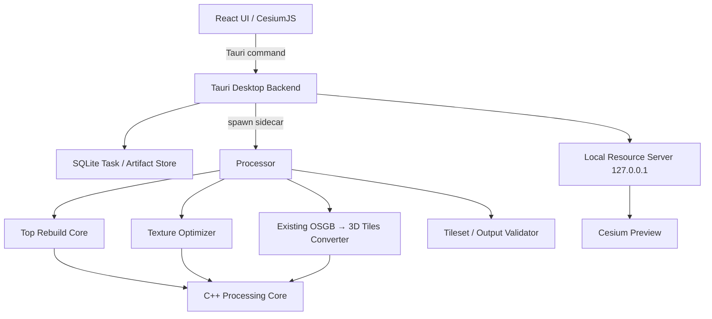

# 3D Tiles 倾斜摄影处理工具 V1：架构重构与顶层重建执行方案

> 面向执行 Agent 的实施文档  
> 日期：2026-09-09  
> 目标仓库：`https://github.com/Nicander93/3dtiles`  
> 当前基线：以 2026-09-09 `master` 为基线，不以历史 `V1_STATUS.md` 中“V1 complete”作为本轮验收结论。

---

## 0. 本文用途与优先级

本文不是概念说明，而是后续执行 Agent 的**直接实施依据**。Agent 应按本文阶段顺序推进，每个阶段达到验收条件后再进入下一阶段。

本文综合以下已讨论并确认的方向：

1. 产品仍以本地桌面数据处理工具为目标，类似 CesiumLab 的倾斜摄影处理工作流。
2. V1 不再要求 OSGB 原生预览，因此不再需要 Qt + OSG Viewer 这条桌面 UI 技术路线。
3. 保留 React + CesiumJS 作为主要 UI 与 3D Tiles 预览技术。
4. 桌面能力收敛到 Tauri；任务、文件选择、SQLite、进程管理由 Tauri/Rust 负责。
5. 处理能力与 UI 解耦，建立独立 Processor 进程作为稳定边界。
6. 现有 `fanvanzh/3dtiles` 转换器继续复用，不因为架构整理而整体重写 OSGB→3D Tiles。
7. 当前 Python `rebuild_top.py` 仅作为算法 baseline / 实验实现，不作为最终 V1 顶层重建内核。
8. 顶层重建按照《倾斜摄影 3D Tiles 顶层重建技术方案 V1》的 Proxy HLOD Pyramid 路线实现：规则 Quadtree、Bottom-up、跨 child 汇总、meshoptimizer 简化、原 UV 纹理降级、REPLACE HLOD。

### 冲突时的文档优先级

若仓库旧文档与本文冲突，执行时按以下优先级处理：

1. **本文：`V1 架构重构与执行方案`**
2. 《倾斜摄影 3D Tiles 顶层重建技术方案 V1》
3. `docs/product/02-v1-implementation.md` 中仍然适用的数据兼容、任务安全、测试原则
4. `docs/product/01-product-definition.md`
5. 旧的 `V1_STATUS.md`、Qt/OSGB Viewer 文档仅作为历史记录

不要为了兼容旧文档继续保留已经取消的 Qt / OSGB 预览架构。

---

# 1. V1 产品边界重新确认

## 1.1 V1 必须完成的用户流程

### 流程 A：OSGB 转换

```text
选择 OSGB 数据目录
        ↓
扫描 / 校验输入与坐标信息
        ↓
OSGB → 3D Tiles
        ↓
可选：顶层重建
        ↓
可选：纹理压缩
        ↓
结果校验
        ↓
登记成果
        ↓
Cesium 预览
```

### 流程 B：已有 3D Tiles 后处理

```text
选择 tileset.json / 3D Tiles 目录
        ↓
兼容性预检
        ↓
可选：顶层重建
        ↓
可选：纹理压缩
        ↓
结果校验
        ↓
登记成果
        ↓
Cesium 预览
```

## 1.2 V1 保留的产品能力

- OSGB → 3D Tiles 转换。
- 坐标、原点与基础 CRS 参数识别/覆盖。
- 3D Tiles 顶层重建。
- KTX2 纹理压缩。
- 统一任务队列、进度、日志、取消、历史。
- 成果管理。
- CesiumJS 3D Tiles 预览。
- 本地运行，不依赖云服务或 Cesium ion。

## 1.3 V1 明确删除的能力

以下能力不要继续实现：

- OSGB 原生预览。
- Qt 主窗口。
- Qt WebEngine。
- QOpenGLWidget / osgViewer UI 集成。
- `apps/osgb_viewer` 产品能力。
- `apps/geoforge_shell` 产品能力。

OpenSceneGraph 仍可继续作为**OSGB 解析/转换底层依赖**存在，这与删除 OSG Viewer 不冲突。

## 1.4 V1 暂不做

- OSGB 编辑。
- 模型裁剪、压平、拉伸。
- Texture Atlas。
- 纹理重新烘焙。
- Remeshing。
- 跨 Tile 强制 weld / mesh repair。
- Adaptive Quadtree / Octree。
- Implicit Tiling。
- 分布式处理。
- 断点续跑。
- 影像、地形、点云等其他 Cesium 数据处理工具。

不要为了“以后可能需要”提前增加通用插件系统、流程编排器或复杂抽象。

---

# 2. 当前仓库的主要问题

当前仓库已经具备一个能运行的 v0.1 产品原型，但代码层存在明显的过渡性结构：

```text
apps/
├── web                 React UI
├── desktop_server      Python API / task runner
├── geoforge_shell      Qt shell
└── osgb_viewer         Qt + OSG viewer

crates/
└── rebuild_top_cli     Rust wrapper

tools/
├── rebuild_top         Python 顶层重建原型
├── ktx2_postprocess    Node KTX2 实验
└── texture_ktx2        Python wrapper

src/                    上游 Rust + C++ 转换核心
```

当前问题不是“代码不能运行”，而是职责重复和技术栈过多：

```text
React
Python Server
Qt
OSG Viewer
Rust
C++
Node helper
```

V1 不应该维持这么多运行时边界。

### 本轮重构目标

最终产品运行时尽量收敛为：

```text
Tauri / Rust       桌面能力、任务管理、进程生命周期
React / CesiumJS   UI 与 3D Tiles 预览
Rust Processor     稳定的任务执行边界
C++ / Rust Core    转换、顶层重建、纹理、Tileset/Geo
```

Python 可以继续用于开发阶段算法实验，但**正式 V1 安装包不应要求用户安装 Python**。

---

# 3. 目标总体架构



## 3.1 各层职责

### React UI

只负责：

- 页面展示。
- 参数编辑。
- 任务列表与日志展示。
- 结果展示。
- Cesium 预览。

不得：

- 直接执行 shell。
- 自己管理长任务生命周期。
- 直接扫描整个磁盘目录。
- 在前端重新实现 Processor 业务逻辑。

### Tauri Desktop Backend

只负责桌面能力：

- 文件/目录选择。
- 启动和停止 Processor。
- 接收 Processor 结构化事件。
- SQLite 任务、成果、设置持久化。
- 本地资源 HTTP 服务。
- 打开目录。
- 应用生命周期。

**Tauri 不实现具体几何算法。**

### Processor

Processor 是 UI 与处理核心之间最重要的稳定边界。

负责：

- 读取任务配置。
- 参数校验。
- 组织处理阶段。
- 调用转换器、TopRebuild、Texture、Validator。
- 输出结构化事件。
- 临时输出目录与最终提交。
- 正确返回退出码。

Processor 不依赖 Tauri，也应该可以独立在命令行运行。

### Processing Core

负责纯数据处理，不理解 UI 和任务数据库。

V1 主要包含：

- 3D Tiles / B3DM / GLB 读取与写出。
- OSGB 转换器已有能力。
- SourceBlock / Representation 建模。
- Quadtree。
- ProxyBuilder。
- meshoptimizer 简化。
- 纹理缩放与编码。
- boundingVolume / geometricError。

---

# 4. 推荐目标目录

不要一次性大规模移动上游 `src/`。当前仓库是基于 `fanvanzh/3dtiles` fork，保留根目录源码结构有利于继续比较 upstream。

最终建议先整理成：

```text
3dtiles/
├── apps/
│   └── desktop/
│       ├── src/                    # React
│       ├── public/
│       ├── package.json
│       └── src-tauri/
│           ├── Cargo.toml
│           └── src/
│               ├── main.rs
│               ├── commands.rs
│               ├── process_manager.rs
│               ├── task_store.rs
│               ├── artifact_store.rs
│               └── resource_server.rs
│
├── crates/
│   └── processor/
│       ├── Cargo.toml
│       └── src/
│           ├── main.rs
│           ├── protocol.rs
│           ├── pipeline.rs
│           └── stages/
│               ├── scan.rs
│               ├── convert.rs
│               ├── rebuild.rs
│               ├── texture.rs
│               └── validate.rs
│
├── src/                            # 现有 fanvanzh Rust/C++ 核心，暂不整体搬迁
│   ├── ...
│   └── top_rebuild/
│       ├── source_model.h/.cpp
│       ├── source_index.h/.cpp
│       ├── tree_builder.h/.cpp
│       ├── representation_selector.h/.cpp
│       ├── proxy_builder.h/.cpp
│       ├── mesh_simplifier.h/.cpp
│       ├── texture_optimizer.h/.cpp
│       ├── tileset_writer.h/.cpp
│       └── quality_metrics.h/.cpp
│
├── tools/
│   └── experiments/
│       └── rebuild_top_py/         # 当前 Python baseline，迁入后不再作为正式运行链路
│
├── tests/
│   ├── fixtures/
│   ├── processor/
│   └── top_rebuild/
│
└── docs/
```

### 4.1 暂时不要做的目录重构

不要现在把整个根 `src/` 搬成：

```text
libs/osgb
libs/tiles
libs/geo
libs/processing
```

长期看这种分层合理，但当前会同时引入大量 include、CMake、Rust FFI 和 upstream merge 变化。

**先在现有源码内部建立清晰模块，再根据实际耦合决定是否第二次拆分。**

---

# 5. UI / Desktop 重构执行方案

## 5.1 原则

当前 React 页面、视觉样式和已经完成的 UI 组件重构尽量保留。

本轮目标是**运行架构重构**，不是再次重做 UI 视觉。

Agent 不要同时进行以下无关改动：

- 再换一次 UI 组件库。
- 全面重写 CSS。
- 改产品配色。
- 重构所有 React component 命名。
- 引入新的状态管理框架，除非当前状态确实无法维护。

## 5.2 页面调整

V1 页面保留：

```text
Workspace
OSGB Convert
3D Tiles Process
Processing
History
Artifacts / Results
3D Tiles Preview
Settings
```

删除：

```text
OSGB Preview
```

对应当前代码应移除：

```text
apps/web/src/pages/OsgbPreview.tsx
```

同时从：

- Router
- Sidebar
- Workspace cards
- 文档

中删除 OSGB 预览入口。

## 5.3 Tauri 迁移方式

为降低一次性改动风险，不要先移动 `apps/web`。

### 第一步

在当前 `apps/web` 内增加：

```text
apps/web/src-tauri/
```

先让现有 React UI 在 Tauri Window 内正常运行。

验收：

- `tauri dev` 可以启动。
- React 页面可用。
- CesiumJS 可初始化。
- 不依赖 Qt。

### 第二步

逐步把现有 HTTP API 替换为 Tauri command/event。

全部完成后再执行：

```text
apps/web → apps/desktop
```

不要一开始同时做 Tauri、API 重写、目录 rename 三件事。

## 5.4 Tauri command 建议

前端只暴露有限能力：

```text
select_input_directory()
select_output_directory()
select_tileset_file()
submit_task(config)
cancel_task(task_id)
get_task(task_id)
list_tasks(filter)
list_artifacts()
open_artifact_directory(artifact_id)
get_preview_url(artifact_id)
get_settings()
update_settings(settings)
```

不要提供：

```text
execute_shell(command)
read_any_file(path)
write_any_file(path)
```

## 5.5 本地 Cesium 资源访问

继续使用 localhost HTTP 的思路，但由 Rust/Tauri 提供，不再依赖 Python Server。

建议：

```text
http://127.0.0.1:<random-port>/artifacts/<artifact-id>/tileset.json
```

资源服务器必须：

- 仅映射已经登记的 artifact root。
- canonicalize path。
- 禁止 `..` 越界。
- 支持相对 URI。
- 正确 Content-Type。
- 支持 Range 请求。
- 只监听 `127.0.0.1`。

不要做通用静态目录服务。

---

# 6. Python `desktop_server` 的迁移

当前 `apps/desktop_server` 已经实现很多有用逻辑，不能直接删除再重写。

应该先**按职责迁移**。

## 6.1 需要迁移到 Tauri 的内容

从当前 Python Server 提取：

- TaskStore / SQLite schema。
- ArtifactStore。
- Task 查询。
- 设置。
- 本地路径映射。

迁入：

```text
apps/desktop/src-tauri/src/
```

## 6.2 需要迁移到 Processor 的内容

从 `runner.py` 提取：

- convert-osgb pipeline。
- rebuild-top pipeline。
- process-tileset pipeline。
- stage 顺序。
- 输出检查。
- 错误分类。

迁入：

```text
crates/processor/src/
```

## 6.3 不要直接照搬的内容

当前 Python runner 主要依赖 subprocess stdout 文本日志，不应原样复制成 Rust。

新 Processor 应自己产生结构化事件，而不是让 Desktop 猜测日志。

## 6.4 删除条件

只有当以下内容全部由 Tauri + Processor 替代后，才删除：

```text
apps/desktop_server/
```

在此之前保留它作为对照实现。

---

# 7. Processor 协议

## 7.1 输入

Processor 推荐接受任务 JSON 文件：

```bash
processor run --task D:/temp/task-123.json
```

示例：

```json
{
  "schemaVersion": 1,
  "taskId": "task-123",
  "operation": "convert-osgb",
  "input": {
    "path": "D:/data/city"
  },
  "output": {
    "path": "D:/output/city"
  },
  "options": {
    "geo": {},
    "rebuildTop": {
      "enabled": true,
      "sourceErrorRatio": 0.5
    },
    "texture": {
      "mode": "ktx2-etc1s"
    }
  }
}
```

### operation

V1 固定：

```text
convert-osgb
process-tileset
```

不要再把 `rebuild-top` 作为必须暴露给产品层的独立用户 operation。

内部 stage 可以有 rebuild，但用户层只需要：

- OSGB 转换任务
- 已有 Tileset 处理任务

必要时保留 CLI debug 子命令，但不要让产品协议过度细碎。

## 7.2 stdout JSONL 事件

Processor stdout 只输出一行一个 JSON event。

示例：

```json
{"schemaVersion":1,"taskId":"task-123","seq":1,"type":"stage","stage":"scan","message":"Scanning input"}
{"schemaVersion":1,"taskId":"task-123","seq":2,"type":"progress","stage":"rebuild","completed":3,"total":4}
{"schemaVersion":1,"taskId":"task-123","seq":3,"type":"metric","name":"proxyTriangles","value":82431}
{"schemaVersion":1,"taskId":"task-123","seq":4,"type":"warning","code":"PROXY_GAP_HIGH","message":"P95 gap exceeds threshold"}
{"schemaVersion":1,"taskId":"task-123","seq":5,"type":"result","path":"D:/output/city"}
```

stderr：

- 原始第三方诊断。
- crash 信息。

Desktop 不从 stderr 推断状态。

## 7.3 stage

固定阶段：

```text
scan
convert
rebuild-index
rebuild-proxy
texture
validate
commit
done
```

已有 3D Tiles 任务跳过 `convert`。

## 7.4 输出目录安全

禁止直接在最终路径边处理边写。

使用：

```text
<output-parent>/.geoforge-task-<task-id>/
```

流程：

```text
创建临时目录
    ↓
所有处理写临时目录
    ↓
validate
    ↓
生成 manifest
    ↓
rename / commit 到最终目录
```

失败/取消：

- 不覆盖源数据。
- 临时目录可清理。
- 不登记 artifact。

## 7.5 取消

V1 不要求复杂暂停/续跑。

至少做到：

- Processor 监听终止信号。
- 在 tile/group/texture 等安全点检查 cancelled flag。
- 退出码区分 cancelled 与 failed。
- 即使被强制终止，因为使用临时目录，也不能污染源数据。

---

# 8. 顶层重建 V1：必须按以下定义实现

## 8.1 顶层重建的定义

顶层重建不是：

```text
全城市模型 → 一个巨大 Mesh
```

而是：

```text
大量原始 Block LOD Tree
          ↓
补建跨 Block 的 Proxy HLOD Pyramid
          ↓
远景少量 Proxy
          ↓ REPLACE
更细 Proxy
          ↓ REPLACE
原始 Block LOD Tree
```

对于百平方公里数据，必须 Bottom-up 局部处理，禁止一次性加载全数据。

---

# 9. 顶层重建输入层：SourceBlock / Representation

## 9.1 不再让 TopRebuilder 直接理解 OSGB

TopRebuilder 不应该直接依赖：

- osg::PagedLOD
- osg::StateSet
- OSGB 文件命名细节

本项目已有 OSGB→3D Tiles 转换器，因此 V1 更实际的实现是：

```text
OSGB
 ↓ existing converter
3D Tiles / GLB/B3DM
 ↓ Tileset Source Adapter
SourceBlock + Representation
 ↓
TopRebuilder
```

这样同时具备处理已有 3D Tiles 的可能。

## 9.2 SourceBlock

C++ 数据结构建议：

```cpp
struct SourceBlock {
    std::string id;
    std::optional<int> gridX;
    std::optional<int> gridY;

    BoundingVolume bounds;
    Mat4d worldTransform;

    std::vector<Representation> representations;
};
```

## 9.3 Representation

```cpp
struct Representation {
    std::filesystem::path contentPath;

    double geometricErrorMeters;
    uint64_t triangleCount;
    uint64_t textureBytes;

    BoundingVolume bounds;
    Mat4d worldTransform;
};
```

Representation 表示：

> 一个 SourceBlock 的某一级可渲染精度表达。

不要把它和 `Tile_x_y_L3.osgb` 之类具体文件命名绑定。

## 9.4 Source Adapter 第一版范围

首先只支持本项目转换器生成的典型显式 Tileset：

- root children 为外部 tileset。
- Block 可从 `Tile_x_y` 解析 grid。
- B3DM / GLB 静态 mesh。
- REPLACE LOD。

同时必须使用 bounds 校验 `gridX/gridY` 的空间邻接关系。

如果：

```text
Tile_1_1 实际空间位置明显不在其网格邻居附近
```

则：

```text
停止规则 Quadtree 重建
返回 GRID_SPATIAL_MISMATCH
```

绝不能静默生成错误的空间树。

---

# 10. Representation 选择

生成第一层 Proxy 时，不要总读取最细模型。

目标原则：

> 足够精确，但尽可能粗。

初始规则：

```text
sourceError <= targetProxyError * sourceErrorRatio
```

默认实验值：

```text
sourceErrorRatio = 0.5
```

在满足条件的 Representation 中选最粗一层。

注意：

- 这是 V1 工程参数，不是 3D Tiles 规范。
- 原始 OSGB 转换得到的 geometricError 可能只是启发式。
- 必须输出实际选择了哪个 Representation，便于调试。

建议 metric：

```text
sourceBlockId
representationIndex
sourceError
triangleCount
textureBytes
```

---

# 11. TreeBuilder：规则 Quadtree

## 11.1 V1 选择

V1 使用规则 Quadtree，不使用：

- Octree
- Adaptive Quadtree
- 空间聚类

原因：倾斜摄影主要沿 XY 平面展开，且 `Tile_x_y` 已提供天然网格。

## 11.2 聚合规则

```cpp
parentX = floor(childX / 2);
parentY = floor(childY / 2);
```

一个 parent 可以有：

```text
1 ~ 4 child
```

因此边界缺块不是错误。

## 11.3 Bottom-up

```text
Base SourceBlock
     ↓ 2×2
L1 Proxy
     ↓ 2×2
L2 Proxy
     ↓
...
     ↓
Root Proxy
```

算法：

```text
level = sourceBlocks

while level.size > 1:
    groups = groupByParentGrid(level)
    next = []

    for group in groups:
        proxy = ProxyBuilder.build(group)
        next.push(proxy)

    if next.size >= level.size:
        stop with NO_FURTHER_REDUCTION

    level = next
```

关键约束：

- 更高层只读取上一层 Proxy。
- 不要每一层重新读取原始 Block 高精度模型。
- 每个 group 完成后释放 Mesh / Texture 工作集。

---

# 12. ProxyBuilder

ProxyBuilder 是整个顶层重建的核心。

## 12.1 数据流

```text
child Representation
        ↓
加载 GLB/B3DM
        ↓
应用 child/world transform
        ↓
转换到 parent local frame
        ↓
跨 child 汇总 primitive
        ↓
按兼容条件分组
        ↓
meshoptimizer simplify
        ↓
纹理降级
        ↓
统计 bounds / error / gap / bytes
        ↓
proxy content
```

## 12.2 Parent Local Frame

每个 Proxy 建立自己的局部坐标系。

必须避免直接使用 ECEF 百万米量级 float 顶点做简化。

建议：

```text
世界坐标累计变换：double
parent local origin：double
实际 mesh position：float
```

流程：

```cpp
worldPosition = childWorldTransform * vertex;
parentLocal = inverse(parentWorldTransform) * worldPosition;
```

### 重要

当前 Python baseline 没有完整解决这件事。

Agent 不要沿用：

```text
直接 concatenate trimesh.geometry
```

这种实现作为最终逻辑。

必须有针对 node/tile transform 的单元测试。

---

# 13. Primitive 汇总策略

## 13.1 不采用

不要：

```text
每个 child 单独 simplify → 最后 concatenate
```

因为这样不能在父级范围内统一分配 triangle budget。

也不要：

```text
所有 primitive 全部焊成一张 mesh
```

这会破坏：

- UV seam
- normal seam
- material boundary
- 非流形结构

## 13.2 V1 采用

先跨 child 汇总，然后按兼容条件分组。

建议 group key 至少包含：

```text
material
vertex attribute layout
primitive mode
texture binding compatibility
```

例如：

```cpp
struct PrimitiveGroupKey {
    MaterialKey material;
    VertexLayout layout;
};
```

同组 primitive 允许统一简化预算。

不同 material 不强行合并。

---

# 14. meshoptimizer 简化

仓库 `vcpkg.json` 已经包含 `meshoptimizer`，优先直接使用当前依赖，不增加第二套简化库。

## 14.1 V1 必须实现

- target triangle count。
- target error meters。
- border protection。
- result simplification error。

概念配置：

```cpp
SimplifyLockBorder
SimplifyErrorAbsolute
```

实际 API 以仓库锁定的 meshoptimizer 版本为准，不要照抄伪 API 而不编译。

## 14.2 Budget

```cpp
struct ProxyBudget {
    uint64_t maxTriangles;
    uint32_t maxTextureSize;
    uint64_t maxTextureBytes;
    uint64_t maxGlbBytes;
    double targetErrorMeters;
};
```

不要只暴露：

```text
simplifyRatio = 0.5
```

ratio 可以作为 UI “质量档位”转成 budget 的内部参数，但底层需要可观测的：

- 输入三角形数。
- 目标三角形数。
- 输出三角形数。
- simplification error。

## 14.3 简化失败策略

如果普通/attribute-aware simplify 无法在 error 约束内达到 target：

1. 返回实际三角形数。
2. 记录 `BUDGET_NOT_REACHED` warning。
3. 不自动无限放宽 error。
4. 不立即引入 remesh。

只有真实数据表明普通路线失败，才在后续评估：

- simplifySloppy
- cluster LOD
- remeshing

---

# 15. 边界策略

## 15.1 V1 不做 weld

不做跨 Tile 强制 weld。

## 15.2 边界保护

应识别：

- topological boundary。
- child block 外边界。
- UV seam。
- material seam。

可锁定或保护关键 border，防止简化后出现明显裂缝。

## 15.3 Gap Metrics

生成后计算相邻 child/proxy 边界差异。

至少记录：

```text
maxGap
P95Gap
```

单位：米。

这些值暂时不直接作为绝对发布阈值，而用于 4×4 实验和真实场景校准。

超过实验阈值：

- warning。
- 可降低简化率重新构建一次。
- 不要悄悄通过。

---

# 16. 纹理策略

## 16.1 V1 原则

保留原 UV。

做：

- texture hash 去重。
- material 去重。
- resize。
- KTX2 / JPEG / WebP 等已有能力中的可控压缩。
- 纹理总预算。

不做：

- Atlas。
- UV remap。
- baking。

## 16.2 层级纹理预算

不要只设置一个全局 `textureScale=0.5`。

ProxyBudget 应包含：

```text
maxTextureSize
maxTextureBytes
maxGlbBytes
```

可建立质量档位，例如：

```text
L1: maxTextureSize 1024/2048
L2: 1024
L3+: 512/256
```

这些只是初始实验值，最终从真实数据标定。

## 16.3 KTX2

KTX2 是优化项，不是 TopRebuild 正确性的前置条件。

调试几何阶段可以先输出普通纹理，确认：

```text
geometry / transform / HLOD
```

正确后再开启 KTX2。

不要把“Cesium 能加载 KTX2”当成“顶层重建完成”。

---

# 17. geometricError

## 17.1 不再采用当前固定 heuristic 作为最终方案

当前 Python baseline 使用类似：

```text
max(2 * childError,
    0.25 * AABB diagonal,
    childError + 1)
```

它可以作为 smoke test 的调度启发式，但不能成为 V1 最终误差依据。

## 17.2 原始 Representation

OSG PagedLOD range 不等于米制 geometricError。

V1 允许使用可校准启发式初值，例如：

```text
coarseError = blockSize * factor
fineError = coarseError / levelScale
```

但必须：

- 标记为 estimated。
- 可输出日志。
- 能通过参数调整。

## 17.3 新 Proxy

新生成 Proxy 优先使用 meshoptimizer 的实际 simplification error。

V1 初始组合：

```text
proxyError = max(childSourceError) + simplificationError
```

要求：

```text
parentError > childError
```

且向上单调增大。

这仍然是工程组合，不是规范数学证明，所以必须结合 Cesium SSE 校准。

---

# 18. TilesetWriter

## 18.1 HLOD 结构

新增 Proxy 使用：

```json
{
  "refine": "REPLACE"
}
```

原始细节 Block 子树保持不变。

结构：

```text
Root Proxy
  ├── L2 Proxy
  │    ├── L1 Proxy
  │    │    ├── Original Block A
  │    │    └── Original Block B
```

## 18.2 Transform

最容易出错的点：原始 child 挂到新 parent 下后累计 world transform 必须保持不变。

必须满足：

```text
oldWorldTransform == newParentWorldTransform * newChildLocalTransform
```

需要单独写 matrix test。

## 18.3 B3DM / GLB

当前转换器输出通常为 3D Tiles 1.0 + B3DM。

V1 不要仅修改 `asset.version` 伪装 1.1。

推荐：

- 内部 ProxyBuilder 生成 GLB。
- 若目标 Tileset 是 1.0，则包装为 B3DM。
- 若未来明确支持 1.1，可直接 content → GLB。

首先保证与现有 converter 输出兼容。

---

# 19. 4×4 原型：顶层重建真正的第一个验收点

当前仓库使用的 6 个稀疏 Tile smoke test 不足以证明 Quadtree 顶层重建。

必须准备：

```text
4 × 4 = 16 个空间连续 Tile_x_y
```

预期：

```text
16 Original Block
      ↓
4 L1 Proxy
      ↓
1 L2 Proxy
```

## 19.1 该原型必须验证

### Tree

- 16 → 4 → 1。
- grid 与 bounds 一致。

### Representation

- 每个 Block 选中了正确 coarse Representation。
- 不默认加载最细层。

### Coordinate

- 相邻 Block 位置无偏移。
- 新 Proxy world transform 正确。

### Geometry

记录：

```text
inputTriangles
outputTriangles
targetTriangles
simplificationError
```

### Texture

记录：

```text
inputTextureBytes
outputTextureBytes
textureCount
maxTextureSize
```

### Seam

记录：

```text
maxGap
P95Gap
```

### Tileset

Cesium 中：

```text
远距离：L2 Root Proxy
 ↓
中距离：4 L1 Proxy
 ↓
近距离：Original Blocks
```

必须真实观察到 REPLACE 切换。

---

# 20. 大范围数据原则

只有 4×4 原型通过后，才能进入完整数据。

扩展顺序：

```text
4×4
 ↓
16×16 / 256 Blocks
 ↓
代表性城区
 ↓
完整百平方公里项目
```

## 20.1 大数据必须记录

```text
Block 总数
Proxy 总数 / 各层节点数
处理总耗时
各 stage 耗时
峰值内存
临时磁盘
输入体积
输出体积
顶层三角形数
顶层纹理 bytes
```

Cesium 对比：

```text
远景请求数
远景下载量
首次完整概览时间
三角形 / draw call
```

不要只说“看起来更快”。

---

# 21. 测试要求

## 21.1 Unit Tests

至少新增：

### TreeBuilder

```text
2×2 → 1 parent
4×4 → 4 → 1
奇数边界
缺块
负 grid index
GRID_SPATIAL_MISMATCH
```

### Transform

```text
child local → world → parent local
重挂载前后 world matrix 不变
大 ECEF + 局部 float 精度
```

### Representation Selector

```text
sourceErrorRatio
选择最粗满足条件层
无满足条件时 fallback
```

### BoundingVolume

```text
parent covers all children
box union
不同 transform 后 bounds
```

### geometricError

```text
proxy >= child
单调递增
simplificationError 被计入
```

## 21.2 Integration Tests

至少：

```text
4 child → 1 proxy
16 child → 4 → 1
```

检查：

- GLB/B3DM 可解析。
- Tileset URI 全部存在。
- Cesium / 3d-tiles-validator 可加载。

## 21.3 Regression

保留当前 Python baseline 输出作为对照，但**不要要求新算法输出字节一致**。

对照的是：

- 节点数量。
- 加载正确性。
- mesh/texture metrics。
- 视觉效果。

---

# 22. 实施阶段

执行 Agent 必须按顺序推进。

---

## Phase 0：冻结现状与更新决策文档

### 任务

- [ ] 记录当前 master commit。
- [ ] 确认当前 React UI 能独立 build。
- [ ] 确认当前 converter smoke 可运行。
- [ ] 确认当前 Python rebuild baseline smoke 可运行。
- [ ] 新增本文到 `docs/product/`。
- [ ] 修改旧产品文档：标记 Qt / OSGB Preview 已取消。
- [ ] `V1_STATUS.md` 改成历史状态，不再写“当前 V1 complete”。

### 不做

此阶段不删任何旧代码。

### 验收

现有 baseline 仍可运行，并明确新架构方向。

---

## Phase 1：Tauri 壳接入现有 React

### 任务

- [ ] 在 `apps/web` 增加 Tauri 2。
- [ ] React 在 Tauri 中运行。
- [ ] Cesium preview 在 Tauri WebView 中运行。
- [ ] 增加目录选择 command。
- [ ] 删除 UI 中 OSGB Preview 页面入口。

### 不做

- 不替换 Python Server。
- 不移动 `apps/web`。
- 不动顶层重建算法。

### 验收

用户能启动一个**没有 Qt** 的桌面应用，并看到当前 React UI 与 Cesium。

---

## Phase 2：Tauri Task Store / Resource Server

### 任务

- [ ] Rust SQLite task store。
- [ ] artifact store。
- [ ] settings。
- [ ] local artifact HTTP server。
- [ ] frontend API 从 HTTP client 抽成统一 desktop adapter。

建议前端先增加：

```text
src/api/desktop.ts
```

页面不要直接调用 `invoke()`，由 adapter 包装。

### 验收

- 重启后 task/history/artifact 数据存在。
- Cesium 从 Rust localhost server 加载 Tileset。

---

## Phase 3：Processor

### 任务

- [ ] 建立 `crates/processor`。
- [ ] TaskConfig schema。
- [ ] JSONL event protocol。
- [ ] convert-osgb pipeline。
- [ ] process-tileset pipeline。
- [ ] temp directory / validate / commit。
- [ ] Tauri spawn Processor。
- [ ] 取消。

### 初始处理器可以继续调用

```text
_3dtile
Python rebuild baseline
现有 texture postprocess
```

此阶段目标是先建立**边界**，不是一次完成所有核心迁移。

### 验收

现有 UI 完整流程不再依赖 Python HTTP Server。

此时可以删除 `apps/desktop_server` 的运行入口，但代码先保留一个阶段做参考。

---

## Phase 4：代码清理与目录收敛

### 前置

Phase 1~3 全部通过。

### 删除

- [ ] `apps/geoforge_shell/`
- [ ] `apps/osgb_viewer/`
- [ ] Qt shell scripts。
- [ ] OSGB viewer scripts。
- [ ] 已失效 Qt 文档改为历史或删除。

### 重命名

```text
apps/web → apps/desktop
```

### Python

当前：

```text
tools/rebuild_top
```

移动到：

```text
tools/experiments/rebuild_top_py
```

明确 README：

```text
baseline only, not release runtime
```

### 验收

仓库从产品运行角度只剩：

```text
Desktop
Processor
Processing Core
```

---

## Phase 5：TopRebuild Core 基础模型 + TreeBuilder

### 任务

- [ ] SourceBlock。
- [ ] Representation。
- [ ] Tileset Source Adapter。
- [ ] Representation selector。
- [ ] TreeBuilder。
- [ ] 4×4 synthetic/tree fixture。

### 此阶段禁止

不要立即做 mesh simplification。

先把：

```text
索引
空间
层级
transform
```

做正确。

### 验收

给 4×4 数据打印：

```text
L0 16
L1 4
L2 1
```

并能输出每个节点 bounds / transform / source representation。

---

## Phase 6：ProxyBuilder Geometry Prototype

### 任务

- [ ] B3DM → GLB payload reader。
- [ ] tinygltf scene transform 正确展开。
- [ ] parent local frame。
- [ ] primitive grouping。
- [ ] meshoptimizer。
- [ ] proxy GLB。
- [ ] simplification error metric。

### 首先关闭纹理优化

纹理只保持原样。

### 验收

2×2 相邻 Block → 一个可正确显示的父 Proxy。

必须通过 transform test。

---

## Phase 7：TilesetWriter + 两层 HLOD

### 任务

- [ ] Proxy B3DM/GLB 写出。
- [ ] boundingVolume。
- [ ] geometricError。
- [ ] REPLACE。
- [ ] 原始子树挂载。
- [ ] world transform invariant。

### 验收

完整 4×4：

```text
16 → 4 → 1
```

Cesium 中远近切换正确。

如果此阶段失败，不要继续做纹理优化。

---

## Phase 8：Boundary / Texture / Budget

### 任务

- [ ] border protection。
- [ ] maxGap / P95Gap。
- [ ] texture hash dedup。
- [ ] resize。
- [ ] maxTextureSize。
- [ ] maxTextureBytes。
- [ ] maxGlbBytes。
- [ ] KTX2 接入已有 BasisU 能力。

### 验收

输出完整 metrics report。

---

## Phase 9：替换 Python Rebuild

前置：Phase 7 至少通过。

### 任务

Processor 的 rebuild stage 从：

```text
python rebuild_top.py
```

切换成新的 TopRebuild Core / CLI。

Python baseline 不删除，用于回归实验。

### 验收

正式用户运行链路无 Python rebuild 依赖。

---

## Phase 10：大数据验证

按：

```text
4×4 → 16×16 → 城区 → 百平方公里
```

逐级扩展。

只有这一阶段完成后，才允许文档写：

```text
支持大范围倾斜摄影顶层重建
```

### Phase 10 执行记录（2026-09-10 Asia/Shanghai）

- [x] 4×4 fixture rebuild reconfirmed (metrics + Processor Rust path)
- [x] 16×16 synthetic (256 leaves) — L0=256 / L1=64 / L2=16 / L3=4 / L4=1; time/RSS/metrics recorded
- [x] OSGBny full tried — **GRID_SPATIAL_MISMATCH** (honest stop; known limit on sparse/non-rect)
- [ ] 城区 real data — **no denser public OSGB under `/workspace/data`**
- [ ] 百平方公里 — **not demonstrated**
- [x] Document supported vs not in `PHASE_REPORTS/phase-10.md` + `SUMMARY.md`
- [ ] Claim `支持大范围倾斜摄影顶层重建` — **NOT allowed** (evidence incomplete)

Honest status: *V1 algorithm complete for continuous regular grids (≤16×16 synthetic); large-scale validation pending.*

Report: [`PHASE_REPORTS/phase-10.md`](./PHASE_REPORTS/phase-10.md).

---

# 23. Agent 执行时的硬性规则

## 23.1 不要大爆炸重写

禁止一次 PR 同时做：

```text
Qt 删除
Tauri
Processor
TopRebuild C++
UI 改版
目录大移动
```

每个 Phase 单独可运行。

## 23.2 不要为了“统一技术栈”重写上游转换器

现有 OSGB→3D Tiles 转换能力已经存在。

除非遇到阻塞 TopRebuild 的明确问题，否则先作为依赖/适配器复用。

## 23.3 不要伪造完成

以下不算顶层重建完成：

- 只改 `tileset.json`。
- 只生成 parent node，没有真实 parent geometry。
- parent geometry 没纹理且仍宣称 V1 完成。
- 第二层没有减少节点却宣称多层成功。
- 只用 6 个稀疏 Tile smoke。
- 通过 Cesium load 就等于质量通过。

## 23.4 不要静默 fallback

出现：

```text
GRID_SPATIAL_MISMATCH
UNKNOWN_REQUIRED_EXTENSION
TRANSFORM_INVALID
BUDGET_NOT_REACHED
PROXY_GAP_HIGH
```

应该：

- 明确 warning/error。
- 记录指标。

不能悄悄使用另一套逻辑导致结果不可解释。

## 23.5 保留 baseline

每次替换已有实现前先保留可运行 baseline。

特别是：

- Python rebuild。
- 当前 KTX2 post-process。
- 当前 converter。

只有替代实现通过同一夹具后再退出正式链路。

---

# 24. 每个 Phase 的 Agent 输出格式

执行 Agent 每完成一个 Phase，应提交一份简短报告：

```markdown
## Phase X 完成报告

### 修改
- ...

### 关键文件
- ...

### 如何运行
- ...

### 测试
- command
- result

### 验收结果
- [x] ...

### 未解决
- ...

### 下一阶段
- ...
```

不要只说“已完成”。

---

# 25. V1 最终验收标准

只有以下全部满足，才能称为 V1：

## Desktop

- [ ] 无 Qt 运行时。
- [ ] Tauri + React 正常安装/运行。
- [ ] Cesium 本地预览可用。

## Task

- [ ] Processor 独立运行。
- [ ] JSONL event。
- [ ] SQLite task/history/artifact。
- [ ] cancel。
- [ ] 临时输出 → validate → commit。

## Convert

- [ ] OSGB→3D Tiles 真实运行。
- [ ] 坐标/原点不会因重构退化。

## Top Rebuild

- [ ] SourceBlock / Representation。
- [ ] 规则 Quadtree + bounds 校验。
- [ ] Bottom-up。
- [ ] parent local frame。
- [ ] 跨 child primitive 汇总。
- [ ] meshoptimizer。
- [ ] simplification error。
- [ ] boundary protection。
- [ ] gap metrics。
- [ ] texture budget。
- [ ] REPLACE HLOD。
- [ ] 4×4 真实数据 16→4→1。

## Validation

- [ ] 原细节子树可正常加载。
- [ ] 远景 Proxy 覆盖完整。
- [ ] 拉近后正确替换。
- [ ] 无明显坐标偏移。
- [ ] 无整块消失。
- [ ] metrics 可输出。

## Large Dataset

至少完成一个代表性大范围数据实验并记录：

- [x] block 数。（合成 16×16 = 256；OSGBny = 6 稀疏未通过）
- [x] 各层 proxy 数。（16×16: 64+16+4+1 = 85 proxies）
- [x] 构建时间。（16×16 ≈ 0.98 s debug）
- [x] 峰值内存。（16×16 maxRSS ≈ 17 MB）
- [x] 输出体积。（16×16 ≈ 13 MB）
- [ ] 重建前后远景请求/下载对比。（未做 Cesium 对比）
- [ ] 代表性城区 / 百平方公里真实数据。（无可用数据；**不可宣称**）

当前应写（Phase 10 后）：

```text
V1 algorithm complete for continuous regular grids (≤16×16 synthetic); large-scale validation pending
```

而不是直接宣称“百平方公里生产可用”或“支持大范围倾斜摄影顶层重建”。

---

# 26. 建议立即开始的第一批工作

Agent 收到本文后，不要直接开始写 TopRebuild C++。

第一批只完成：

```text
Phase 0
Phase 1
```

即：

1. 固化当前 baseline。
2. 更新产品文档，取消 Qt / OSGB Preview。
3. 在现有 React UI 中接入 Tauri。
4. 保持现有处理后端暂时不变。
5. 确认 Cesium 在 Tauri 中正常运行。

完成后再开始 Phase 2。

原因：当前仓库最先需要解决的是**产品运行架构已经与新决策不一致**。如果在 Qt/Python Server 架构上继续开发新的 TopRebuild，后续会再次迁移大量外围代码。

顶层重建算法本身则按照本文 Phase 5~10 独立推进，避免 UI 与算法互相阻塞。

---

# 27. 最终目标形态

V1 完成后，代码和运行关系应该足够简单：

```text
                     ┌──────────────────────┐
                     │ Tauri + React        │
                     │ CesiumJS             │
                     └──────────┬───────────┘
                                │
                           TaskConfig
                                │
                     ┌──────────▼───────────┐
                     │ Processor            │
                     │ scan / convert       │
                     │ rebuild / texture    │
                     │ validate / commit    │
                     └──────────┬───────────┘
                                │
        ┌───────────────────────┼───────────────────────┐
        │                       │                       │
┌───────▼────────┐      ┌───────▼─────────┐     ┌──────▼────────┐
│ OSGB Converter │      │ TopRebuild Core │     │ Texture Core  │
│ existing code  │      │ Quadtree / HLOD │     │ BasisU/KTX2   │
└────────────────┘      └─────────────────┘     └───────────────┘
```

核心原则只有三个：

1. **UI 不理解算法。**
2. **Processor 不实现几何细节。**
3. **TopRebuild 不理解 OSGB UI 或任务系统，只处理统一的空间与 Representation。**

只要这三个边界保持清楚，后续增加影像、地形或其他 Cesium 数据处理能力时，也不需要重新推翻桌面架构。
