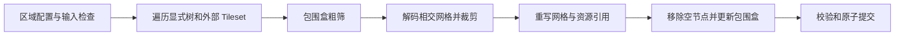

# 3D Tiles 范围裁剪技术方案（待讨论）

目标：用户指定区域后，导出实际保留区域内几何的独立 Tileset。第一版建议提供“保留范围内”操作，先支持矩形与凸多边形、显式 B3DM/GLB 三角网格。后续再支持凹多边形、孔洞、挖除区域与高度限制。

## 三种能力的取舍

| 方式 | 结果 | 建议用途 |
|---|---|---|
| Cesium 视图裁剪 | 改变当前画面的显示，不改模型文件 | 区域编辑后的即时预览 |
| 按瓦片包围盒筛选 | 输出相交瓦片，边界仍可能有范围外几何 | 独立的粗筛/区域提取模式，必须明确标注 |
| 三角形精确裁剪 | 边界网格被实际裁开，导出可独立使用 | 范围裁剪的正式导出目标 |

建议把视图预览和几何导出接到同一份区域配置。不能用视图效果或整瓦片复制代替精确裁剪的验收。

## 处理流程

完全在区域外的瓦片删除；完全在区域内的资源尽量原样复制；边界相交瓦片才解码和裁剪。只有保守包围盒能够证明“不相交/完全包含”时才能使用快路径；判断不确定就进入细处理。

## 坐标与精度

区域建议存为有明确 CRS 的 GeoJSON Polygon；地图输入用 WGS84，经纬度以度为单位。没有地理定位的局部坐标数据需要单独的坐标模式，不能靠数值大小猜测。

遍历时累计父级、外部 Tileset 根的 transform；内容还要处理 glTF 节点变换、Y-up→Z-up 和 B3DM RTC_CENTER。WGS84 region 的包围盒不乘 tile transform。这些语义必须复用或抽取现有解析能力，并通过测试验证，避免另写一套近似坐标逻辑。

小范围地理区域以裁剪区附近的 ENU 作为判断坐标。计算使用 f64；裁剪平面可经矩阵转到网格局部坐标，避免先把 f32 顶点烘焙成百万米级 ECEF 后再做交点。区域跨度、极区及跨日期变更线需要单独校验，第一版应明确限制适用范围，并测量 ENU 投影的误差。

## 几何和属性

凸多边形可表示为一组竖直半平面，逐平面裁剪每个三角形，再把保留多边形三角化。新增顶点按边上交点参数插值 POSITION、TEXCOORD、COLOR 和法线；法线重新归一化，切线需要维护 handedness 或重算。不同材质 primitive 保持分离。

第一版建议保留原纹理，重新写索引、accessor/bufferView、长度和包围范围；不同时做贴图重新打包或网格简化。倾斜摄影表面裁剪后边缘可以开放，封口应作为单独选项，不默认制造不存在的侧面。

压缩网格、蒙皮、动画、实例化、点云以及暂不支持的 feature ID/属性编码必须在预检中明确失败，不能静默丢失。先核对现有 top_rebuild 的 GLB/B3DM 解析器能保留哪些属性，再决定复用范围。

## LOD 与输出

原树中每个有内容的 LOD 都需要用同一裁剪区域处理，避免远景加载未裁剪父级后让范围外模型重新出现。删除空内容和空分支，重算内容及节点包围盒；保留原误差值作为第一版策略，并验证单调性与父级空间包含关系。重新生成 HLOD 可以作为后续优化，不应把合并包装节点误认为新的低模。

资源输出采用独立命名空间和相对 URI，保留有效材质与依赖。沿用 processor 的取消、任务日志、临时目录归属与 no-replace 提交。报告应记录粗筛/复制/裁剪/删除的瓦片数量、前后顶点和三角形数量，以及告警和不支持的内容。

## 分阶段交付与验证

1. **纯算法内核**：局部坐标矩形/凸多边形；测试完全内外、穿边、落在边上、退化三角形、面积误差、UV/法线插值和浮点容差。
2. **CLI 导出**：小型 GLB/B3DM fixture；测试多级 transform、RTC、外部 Tileset、不同 LOD、空结果、缺材质依赖、取消和输入保护。
3. **桌面区域输入**：先提供数值范围和 GeoJSON 导入，再添加地图绘制；Playwright 验证真实 processor 导出，而预览截图用于人工辅助。
4. **扩展多边形**：再评估凹区域/孔洞的二维布尔运算和稳健三角化库，以面积守恒、无重复三角形和确定性作为门槛。

端到端判定应直接读取输出 mesh：全部保留顶点满足裁剪半平面，交点位置和面积在容差内，范围外三角形为零，属性资源有效。视图成功加载不足以单独证明几何裁剪正确。

建议先确定两件事：首版的“矩形”是地图上的经纬度范围还是局部 ENU 矩形；输入只允许已有地理定位数据，还是同时支持局部模型坐标。上述方案默认地图 WGS84 区域、已有定位的静态网格，并先做“保留范围内”。

依据：[3D Tiles 坐标、外部 Tileset、包围盒](https://github.com/CesiumGS/3d-tiles/blob/main/specification/README.adoc)、[glTF 2.0 网格、属性和节点变换](https://github.com/KhronosGroup/glTF/blob/main/specification/2.0/Specification.adoc)。这是设计提案，尚未实现裁剪功能。
